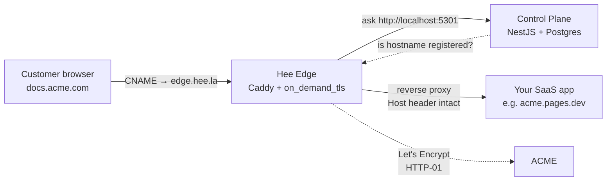

> [!NOTE]
> **Hee** is a shared edge service for SaaS products that need to offer custom domains to their customers. One CNAME, automatic TLS, multi-tenant API — without paying Cloudflare Enterprise or Approximated's per-domain markup.
>
> Production URL: [hee.la](https://hee.la) · Portal: [app.hee.la](https://app.hee.la) · Docs: [docs.hee.la](https://docs.hee.la) · Status: [status.hee.la](https://status.hee.la)

## The problem Hee solves

When your SaaS grows to the point where customers want to bring their own domain (`docs.acme.com` pointed at your app instead of `acme.your-app.com`), you hit an industry-wide wall:

| Option | Gotcha |
|--------|--------|
| **Cloudflare for SaaS** | Custom Origin SNI + predictable Worker routing are **Enterprise-only**. Five-figure contracts before 100 customers. |
| **Approximated** | Closed-source, per-domain pricing. Scales poorly past ~200 customers. Single region. |
| **Roll your own** | Caddy + Postgres + a box covers 80%, but you'll burn a month on cert rate-limit handling, multi-tenant API, portal UX. |

Hee is the missing middle ground: **open source**, **priced per plan (not per domain)**, **one CNAME** end-to-end.

## Who this is for

- **Colbin, YoFix, Kundali** (our own products) — all three need custom domains and none of them justify Cloudflare Enterprise on their own.
- **External SaaS teams** — anyone hitting the same wall we hit. Typical profile: 10-500 customers using custom domains, no appetite for a €1k/mo Cloudflare contract.
- **Teams that may one day want to self-host** — compliance, sovereignty, latency. The edge is open source; they can fork and run it themselves if Hee's SaaS pricing ever stops making sense.

## How it works



Three moving parts:

1. **Edge (Caddy 2.11)** — TLS termination, cert issuance on-demand, reverse proxy to your upstream. Runs on a €5/mo Hetzner box in Falkenstein (Germany).
2. **Control plane (NestJS + Postgres)** — multi-tenant registry, magic-link auth, portal API. Same box.
3. **Portal (Next.js)** — the web UI where you manage projects, domains, API tokens, team members.

## Use cases

### 1. Offering custom domains to your SaaS customers

This is the headline feature. Your customer wants their docs site on `docs.customer.com` pointed at your app. You:

1. POST the hostname to Hee
2. Tell your customer to add one CNAME in their DNS
3. Hee auto-issues a Let's Encrypt cert on the first HTTPS request and reverse-proxies to you

**Result**: customer gets a branded URL, you get normal Host-header routing in your app, nobody touches Cloudflare Enterprise.

### 2. Shared edge across multiple internal products

You run Colbin, YoFix, and Kundali. Each has its own project in Hee; each project has its own API token scope, domain namespace, and billing line. One box serves all three.

### 3. Tenant-specific metadata at the edge

When registering a domain, attach arbitrary JSON (workspace ID, theme override, plan tier). Hee returns it verbatim at `/v1/edge/resolve?hostname=...` so your app can route multi-tenant requests without an extra database lookup.

## How to use

> [!TIP]
> Full step-by-step walkthrough: [docs.hee.la/quickstart](https://docs.hee.la/quickstart)

### Step 1 — Create an account + project

Sign in at [app.hee.la/login](https://app.hee.la/login) with a magic link. Create a project with a slug, display name, and your upstream URL (where Hee reverse-proxies requests).

### Step 2 — Issue an API token

Portal → project → API tokens → Issue. Tokens are shown **once** (masked after 10 s). Store in your secrets manager.

### Step 3 — Register a customer's domain

```bash
curl -X POST https://api.hee.la/v1/edge/domains \
  -H "Authorization: Bearer $HEE_API_TOKEN" \
  -H 'Content-Type: application/json' \
  -d '{
    "hostname": "docs.customer.com",
    "metadata": { "workspaceId": "ws_abc123" }
  }'
```

Response returns the record with `verified: false` until DNS is in place.

### Step 4 — Tell your customer

```
Type:  CNAME
Name:  docs
Value: edge.hee.la
```

That's the entire customer action.

### Step 5 — Watch verification flip

A background probe runs every 5 minutes and flips `verified: true` when the CNAME is set correctly. In the portal it shows as a green badge.

### Step 6 — First HTTPS request issues the cert

~3 seconds cold for Let's Encrypt HTTP-01. Sub-10ms warm afterwards. From then on, traffic flows customer → Hee edge → your upstream with the original Host header preserved.

## Scorecard vs alternatives

| Capability | Hee | Cloudflare for SaaS | Approximated |
|------------|-----|---------------------|--------------|
| Entry price | €0 (3 domains free) | Enterprise contract | $29/mo minimum |
| Custom Origin SNI | ✅ | Enterprise only | ✅ |
| Worker / edge middleware | Planned Phase 2 | Paid + routes break on SaaS | ❌ |
| Open source edge | ✅ | ❌ | ❌ |
| Multi-tenant API | ✅ | ✅ | ✅ |
| Self-hostable | ✅ | ❌ | ❌ |
| Metadata passthrough | ✅ | ❌ | Limited |
| Status page | Public (Upptime) | Cloudflarestatus | statuspage.io |
| DNS verification | ✅ Automatic | ✅ | ✅ |

## Current capabilities

| Component | Status |
|-----------|--------|
| Multi-tenant edge with on-demand TLS | ✅ Live |
| Magic-link authentication (Postmark) | ✅ Live |
| Portal: projects, domains, API tokens | ✅ Live |
| Team invitations (owner/member roles) | ✅ Live |
| DNS verification probe (every 5 min) | ✅ Live |
| TypeScript SDK (`@heela/sdk`) | ✅ Built, not yet on npm |
| Rate limiting on expensive endpoints | ✅ Live (5/min magic link) |
| Public status page | ✅ status.hee.la |
| Public docs site | ✅ docs.hee.la |
| Marketing site | ✅ hee.la |

## What's next (roadmap)

### Phase 2 deferred
- **Stripe metered billing** — plans: Free (3 domains), Pro €19/mo (25), Scale €49/mo (100), Enterprise (custom)
- **Multi-region edge** — second Hetzner box in us-east, Redis-backed cert storage, GeoDNS
- **Prometheus metrics** — per-project 5xx rate, cert-issuance latency, request volume

### Phase 3
- Per-project audit logs (compliance prep)
- Wildcard custom hostnames (`*.customer.com` single registration)
- Custom error pages per tenant

### Phase 4
- Bring-your-own-SSL for enterprise
- SSO / SAML
- SOC2 Type I
- Dedicated edge boxes for enterprise isolation

## Why this matters (strategic angle)

1. **Unblocks our own products** — Colbin, YoFix, and Kundali each have a custom-domain story without each paying Cloudflare Enterprise.
2. **Marginal-cost SaaS business** — one €5/mo box serves hundreds of tenants. Break-even at ~5 paying customers on the Free-plus-one-conversion model.
3. **Acquisition-friendly architecture** — every piece is open standards. If we ever sold the company, an acquirer could drop it onto their own infra without a migration.
4. **Compounding docs + portal + status** — the marketing site, docs site, and status page together make Hee look like a real, trustworthy product from day one rather than a side project with a landing page.

## Ops reference

| Concern | Where |
|---------|-------|
| Source code | [github.com/shekhardtu/heela](https://github.com/shekhardtu/heela) |
| Status page source | [github.com/shekhardtu/hee-status](https://github.com/shekhardtu/hee-status) |
| Production host | Hetzner edge-1, fsn1, `49.13.214.28` |
| Postmark sender | `auth@hee.la` (DKIM verified) |
| Deploy | `bash infra/server/deploy.sh` from local repo |
| Logs | `docker compose logs control-plane --tail=50` on edge-1 |
| Secrets | `/opt/hee/secrets/` on edge-1 |

---

**Status**: Live · Phase 1 + 1.5 + Phase 2 (rate limiting, invites) complete. Phase 2 billing + multi-region deferred.
